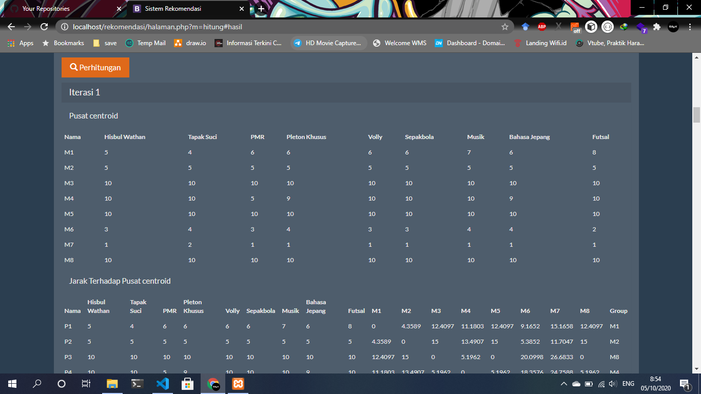
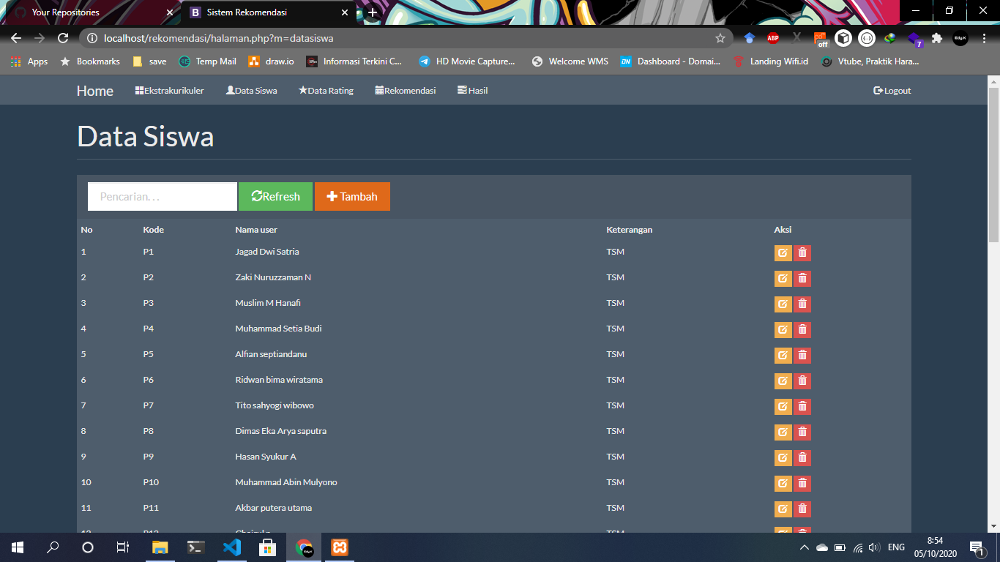

<br />
<p align="center">
  <h3 align="center">Sistem Rekomendasi</h3>

  <p align="center">
    Pemilihan ekstrakulikuler menggunakan metode clustering
    <br />
    <a href="https://github.com/edy-kurniawan/rekomendasi/"><strong>Explore the docs »</strong></a>
    <br />
    <br />
    <a href="https://github.com/edy-kurniawan/rekomendasi/">View Demo</a>
    ·
    <a href="https://github.com/edy-kurniawan/rekomendasi/issues">Report Bug</a>
    ·
    <a href="https://github.com/edy-kurniawan/rekomendasi/issues">Request Feature</a>
  </p>
</p>


<!-- TABLE OF CONTENTS -->
## Table of Contents

* [About the Project](#about-the-project)
  * [Built With](#built-with)
* [Getting Started](#getting-started)
  * [Installation](#installation)
* [Usage](#usage)
* [Roadmap](#roadmap)
* [Contributing](#contributing)
* [License](#license)
* [Contact](#contact)


<!-- ABOUT THE PROJECT -->
## About The Project





### Built With
This section should list any major frameworks that you built your project using. Leave any add-ons/plugins for the acknowledgements section. Here are a few examples.
* [Bootstrap](https://getbootstrap.com)
* [Mysql](#)
* [PHP(https://php.com)


<!-- GETTING STARTED -->
## Getting Started

This is an example of how you may give instructions on setting up your project locally.
To get a local copy up and running follow these simple example steps.


### Installation

1. Manual download or
2. Clone the repo
```sh
git clone https://github.com/edy-kurniawan/rekomendasi.git
```

<!-- USAGE EXAMPLES -->
## Usage

Use this space to show useful examples of how a project can be used. Additional screenshots, code examples and demos work well in this space. You may also link to more resources.

_For more examples, please refer to the [Documentation](#)_


<!-- ROADMAP -->
## Roadmap

See the [open issues](https://github.com/edy-kurniawan/rekomendasi/issues) for a list of proposed features (and known issues).


<!-- CONTRIBUTING -->
## Contributing

Contributions are what make the open source community such an amazing place to be learn, inspire, and create. Any contributions you make are **greatly appreciated**.

1. Fork the Project
2. Create your Feature Branch (`git checkout -b feature/AmazingFeature`)
3. Commit your Changes (`git commit -m 'Add some AmazingFeature'`)
4. Push to the Branch (`git push origin feature/AmazingFeature`)
5. Open a Pull Request


<!-- LICENSE -->
## License

Distributed under the MIT License. See `LICENSE` for more information.


<!-- CONTACT -->
## Contact

Name - [@edy_.kurniawan](https://www.instagram.com/edy_.kurniawan/) - edy.kurniawan280898@gmail.com

Project Link: [https://github.com/edy-kurniawan/rekomendasi](https://github.com/edy-kurniawan/rekomendasi)


<!-- MARKDOWN LINKS & IMAGES -->
<!-- https://www.markdownguide.org/basic-syntax/#reference-style-links -->
[contributors-shield]: https://img.shields.io/github/contributors/edy-kurniawan/rekomendasi/.svg?style=flat-square
[contributors-url]: https://github.com/edy-kurniawan/rekomendasi/graphs/contributors
[forks-shield]: https://img.shields.io/github/forks/edy-kurniawan/rekomendasi/.svg?style=flat-square
[forks-url]: https://github.com/edy-kurniawan/rekomendasi//network/members
[stars-shield]: https://img.shields.io/github/stars/edy-kurniawan/rekomendasi/.svg?style=flat-square
[stars-url]: https://github.com/edy-kurniawan/rekomendasi/stargazers
[issues-shield]: https://img.shields.io/github/issues/edy-kurniawan/rekomendasi/.svg?style=flat-square
[issues-url]: https://github.com/edy-kurniawan/rekomendasi/issues
[license-shield]: https://img.shields.io/github/license/edy-kurniawan/rekomendasi/.svg?style=flat-square
[license-url]: https://github.com/edy-kurniawan/rekomendasi/blob/master/LICENSE.txt
[linkedin-shield]: https://img.shields.io/badge/-LinkedIn-black.svg?style=flat-square&logo=linkedin&colorB=555
[linkedin-url]: https://linkedin.com/in/othneildrew
[product-screenshot]: images/screenshot.png
